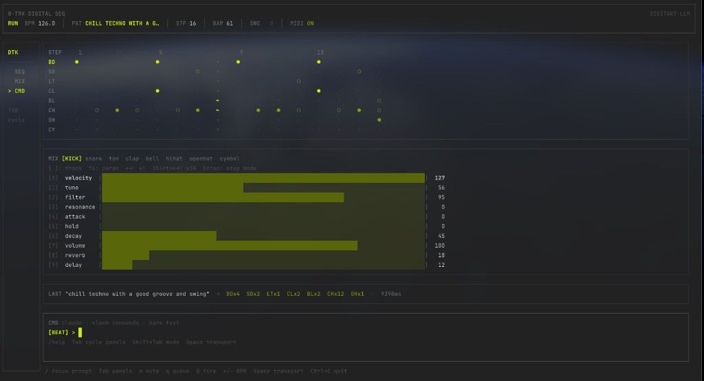

# digitakt-llm



Generate drum patterns on an **Elektron Digitakt** in real time with **Claude Opus 4.6**. Describe a vibe in plain English — the pattern plays over **USB MIDI** and loops until you change it.

## Key features

- **Ink terminal UI** — Elektron-style layout: transport and tempo in the header, **SEQ** (8-track step grid with velocity dots), **MIX** (per-track CC bars and step overrides), and **CMD** (slash commands and natural-language prompts).
- **Live pattern engine** — WebSocket-driven grid, playhead, mutes, swing, per-step probability, gates, conditional trigs, and chromatic pitch per track.
- **Claude integration** — Beat mode for generation from text; chat mode and `/ask` for questions; `/gen` and **Ctrl+G** to turn answers into patterns; optional activity log.
- **Digitakt-oriented MIDI** — Eight tracks map to channels 1–8; CCs for tune, filter, envelopes, sends, and more; save/load patterns, fills, chains, and pattern history.
- **FastAPI backend** — REST + `/ws` event stream so the same server can power the TUI or other clients.

## Hardware Requirements

- **Elektron Digitakt** (any firmware) connected via USB
- USB MIDI cable or USB-B to USB-A cable (the Digitakt appears as a class-compliant MIDI device — no driver needed on macOS or Linux)

## Requirements

- Python 3.11+
- [Bun](https://bun.sh) ≥1.1
- macOS or Linux (Windows untested)
- An Anthropic API key

## Setup

```bash
# Python backend
python3 -m venv .venv && source .venv/bin/activate
pip install -e ".[dev]"

# Bun/Ink frontend
cd tui && bun install && cd ..

# Set your API key
export ANTHROPIC_API_KEY=sk-ant-...
# or add it to a .env file: ANTHROPIC_API_KEY=sk-ant-...

# Launch
digitakt
```

## Usage

`digitakt` launches the Bun/Ink TUI (shown above) with **Tab** cycling **SEQ → MIX → CMD** (plus **LOG** when the activity log is open):

- **SEQ** — Step grid for all eight tracks, live from the server, with keyboard mutes and queued mutes.
- **MIX** — Per-track parameters (velocity + CCs), bar readouts, and step mode for per-step CC edits.
- **CMD** — Slash commands, `/help` (scrollable), and bare-text prompts in beat or chat mode.

### Commands

Type `/help` in the prompt panel for the full reference. All commands are prefixed with `/` or entered as bare text:

| Command | Description |
|---------|-------------|
| `play` / `stop` | Start or stop playback |
| `bpm <n>` | Set tempo (20–400) |
| `swing <n>` | Set swing amount (0–100) |
| `length [8\|16\|32]` | Set pattern step count |
| `prob <track> <step> <value>` | Step probability 0–100 (1-indexed) |
| `vel <track> <step> <value>` | Step velocity 0–127 (1-indexed) |
| `gate <track> <step> <0-100>` | Note gate length (% of step duration) |
| `pitch <track> <0-127>` | MIDI note number for track (chromatic mode) |
| `cond <track> <step> <1:2\|not:2\|fill\|clear>` | Conditional trig on a step |
| `random [track\|all] [vel\|prob] [lo-hi]` | Randomize velocity or probability |
| `randbeat` | Generate a random techno beat |
| `cc <track> <param> <value>` | Send CC to track globally (0–127) |
| `cc-step <track> <param> <step> <v>` | Per-step CC override (-1 to clear) |
| `save <name> [#tag1 #tag2]` | Save pattern with optional tags |
| `load <name>` | Queue a saved pattern for the next loop |
| `patterns [#tag]` | List saved patterns, optionally filtered by tag |
| `fill <name>` | Queue pattern as a one-shot fill (plays once, reverts) |
| `new` | Reset to empty pattern |
| `undo` | Revert to previous pattern |
| `history` | Show pattern history |
| `log` | Toggle activity log |
| `clear` | Clear activity log |
| `mode [chat\|beat]` | Switch input mode |
| `ask <question>` | Ask Claude a question (any mode) |
| `help` | Show command reference |
| `quit` / `q` | Exit |
| *(bare text in BEAT mode)* | Generate a new pattern from your description |
| *(bare text in CHAT mode)* | Ask Claude a question |

**First prompt** generates a fresh pattern. **Subsequent prompts** are treated as variations (prior pattern and prompt are passed as context).

### CC control

Each track maps to its own MIDI channel (kick → ch 1, snare → ch 2, … perc4 → ch 8), matching the Digitakt's physical track layout.

**Tracks:** `kick` `snare` `tom` `clap` `bell` `hihat` `openhat` `cymbal`

**Params:**

| Param | CC# | Default | Description |
|-------|-----|---------|-------------|
| `tune` | 16 | 64 | Sample pitch |
| `filter` | 74 | 64 | Filter cutoff |
| `resonance` | 71 | 64 | Filter resonance |
| `attack` | 80 | 64 | Amp attack |
| `decay` | 82 | 64 | Amp decay |
| `volume` | 95 | 100 | Track volume |
| `reverb` | 91 | 0 | Reverb send |
| `delay` | 30 | 0 | Delay send |

```
> cc kick filter 90
CC set: kick filter = 90

> cc show
        tune  filter  res  atk  dec  vol  rev  dly
kick      64      90   64   64   64  100    0    0
snare     64      64   64   64   64  100    0    0
...
```

## Panels

| Panel | Description |
|-------|-------------|
| SEQ | Step grid (8/16/32 steps) with mute indicators and focus rail |
| MIX | Per-track parameters (velocity, filter, decay, reverb, etc.) |
| CMD | Commands, generation, and `/help` |

Use **Tab** to cycle focus between panels (see **Usage**).

## Keyboard Shortcuts

| Key | Action |
|-----|--------|
| `Tab` | Cycle panels (SEQ → MIX → CMD, and LOG when open) |
| `↑` / `↓` | Navigate tracks (SEQ) or parameters (MIX) |
| `Space` | Play / stop |
| `+` / `-` | BPM +1 / -1 |
| `m` | Mute selected track (SEQ panel) |
| `←` / `→` | Adjust velocity or CC ±1 (MIX panel) |
| `Shift+←` / `Shift+→` | Adjust velocity or CC ±10 (MIX panel) |
| `[` / `]` | Previous / next track (MIX panel) |
| `Enter` | Submit prompt or command (CMD panel) |
| `Ctrl+C` | Quit |

## Environment Variables

| Variable | Default | Description |
|----------|---------|-------------|
| `ANTHROPIC_API_KEY` | (required) | Anthropic API key |
| `PORT` | `8000` | FastAPI server port |

## API Reference

The FastAPI server starts automatically on `http://localhost:8000`.

| Method | Path | Description |
|--------|------|-------------|
| `GET` | `/state` | Full application state as JSON |
| `POST` | `/generate` | `{"prompt": "..."}` → 202 Accepted |
| `POST` | `/bpm` | `{"bpm": 140.0}` |
| `POST` | `/play` | Start playback |
| `POST` | `/stop` | Stop playback |
| `GET` | `/patterns` | `{"names": [...]}` |
| `POST` | `/patterns/{name}` | Save current pattern |
| `GET` | `/patterns/{name}` | Queue saved pattern |
| `POST` | `/cc` | `{"track": "kick", "param": "filter", "value": 90}` |
| `GET` | `/cc` | Current CC state for all tracks |
| `WS` | `/ws` | Event stream (see below) |

## Contributing

See [CONTRIBUTING.md](CONTRIBUTING.md) for dev setup, test instructions, and PR conventions.

## Attaching a Frontend

The WebSocket at `ws://localhost:8000/ws` pushes every internal event as JSON:

```json
{"event": "pattern_changed", "data": {"pattern": {...}, "prompt": "..."}}
{"event": "generation_started", "data": {"prompt": "..."}}
{"event": "generation_complete", "data": {"pattern": {...}, "prompt": "..."}}
{"event": "generation_failed", "data": {"prompt": "...", "error": "..."}}
{"event": "bpm_changed", "data": {"bpm": 140.0}}
{"event": "playback_started", "data": {}}
{"event": "playback_stopped", "data": {}}
{"event": "midi_disconnected", "data": {"port": "..."}}
{"event": "cc_changed", "data": {"track": "kick", "param": "filter", "value": 90}}
```

`GET /state` returns the full `AppState` shape. Control playback with the REST endpoints above.

## License

MIT — see [LICENSE](LICENSE).
